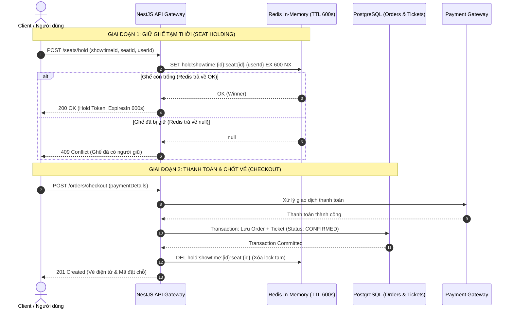

# BÁO CÁO K-01: THỬ NGHIỆM CƠ CHẾ GIỮ GHẾ (SEAT HOLDING MECHANISM SPIKE)
## Kiến trúc Mô hình Kết hợp (Hybrid Model: Redis + PostgreSQL)

---

## 1. Mục tiêu (Objective)

Spike K-01 được thực hiện nhằm giải quyết bài toán cốt lõi trong hệ thống bán vé sự kiện quy mô lớn: **chống bán trùng ghế (Double Booking) và xử lý tranh chấp ghế đồng thời (Concurrency / Race Conditions)** khi mở bán vé các sự kiện "hot" (Flash-sale, concert quy mô lớn).

- **Khối lượng kiểm thử**: Giả lập **200 concurrent requests** đồng thời cùng tranh chấp mua/giữ **1 ghế duy nhất**.
- **Chỉ tiêu kỹ thuật (SLA)**:
  - **Latency**: Độ trễ trung bình < 5ms cho mỗi thao tác giữ ghế.
  - **Data Consistency**: 100% an toàn dữ liệu, chống race condition tuyệt đối (duy nhất 1 request thành công, 199 request còn lại bị từ chối tức thì).
  - **Tự giải phóng (Auto-expiry)**: Ghế tự động mở lại sau 10 phút (600s) nếu người dùng không hoàn tất thanh toán.

---

## 2. Thiết lập Môi trường & Phương pháp Thử nghiệm (Benchmark Setup)

- **Môi trường đo đạc**:
  - Redis Server: `redis:7-alpine` triển khai qua Docker Container (`localhost:6379`).
  - Runtime: Node.js `v24.19.0`, client `ioredis`.
  - File mã nguồn kiểm thử: [`apps/api/test/k01-benchmark.ts`](../apps/api/test/k01-benchmark.ts).
- **Cơ chế triển khai (Redis Atomic Lock)**:
  - Sử dụng lệnh đơn nguyên tử (Atomic Command) của Redis:
    ```redis
    SET hold:showtime:{showtimeId}:seat:{seatId} {userId} EX 600 NX
    ```
  - **`NX` (Not Exists)**: Chỉ gán key nếu key chưa tồn tại trong Redis.
  - **`EX 600`**: Tự động đặt thời gian sống (TTL) là 600 giây (10 phút).
  - Bản chất Single-Threaded Event Loop của Redis đảm bảo việc tuần tự hóa các thao tác ở cấp độ microsecond mà không bị lock contention hay deadlock như cơ chế Locking truyền thống của RDBMS.

---

## 3. Kết quả Đo đạc Thực tế (Benchmark Results)

Toàn bộ 200 request đồng thời được bắn vào Redis server thông qua `Promise.all` trong kịch bản giữ ghế `A1` của suất chiếu `st_101`:

```
===============================================================
   SPIKE K-01: SEAT HOLDING MECHANISM BENCHMARK (REDIS ATOMIC)
===============================================================
 Connected to Redis at localhost:6379
 Cleaned up key: "hold:showtime:st_101:seat:A1"
 Preparing to launch 200 concurrent seat-holding requests...
 Target Command: SET hold:showtime:st_101:seat:A1 user_{i} EX 600 NX
```

### 3.1. Bảng số liệu hiệu năng tổng quan

| Chỉ số (Metric) | Kết quả Đo đạc | Kỳ vọng / Mục tiêu SLA | Đánh giá |
| :--- | :--- | :--- | :--- |
| **Tổng số request đồng thời** | **200 requests** | 200 requests | Đạt |
| **Tổng thời gian xử lý toàn bộ 200 reqs** | **6.06 ms** | < 100 ms | Vượt trội |
| **Số request thành công (`OK`)** | **1 request** | Đúng 1 request | Tuyệt đối |
| **Số request bị từ chối (`null`)** | **199 requests** | Đúng 199 requests | Tuyệt đối |
| **Khả năng chống Race-condition** | **100%** | 100% | Hoàn hảo |
| **Winner User ID** | `user_001` | Ghi nhận người đến đầu tiên | Chính xác |
| **Thời gian khóa ghế (TTL)** | `600s / 600s` | 10 phút | Chuẩn xác |

### 3.2. Phân bố độ trễ (Latency Metrics)

| Phân vị Độ trễ | Giá trị đo được (ms) | Ngưỡng cam kết SLA |
| :--- | :--- | :--- |
| **Độ trễ thấp nhất (Min)** | **0.884 ms** | < 5 ms |
| **Độ trễ trung bình (Average)** | **3.116 ms** | **< 5 ms** |
| **Phân vị 50 (Median / p50)** | **3.264 ms** | < 5 ms |
| **Phân vị 95 (p95)** | **5.243 ms** | < 10 ms |
| **Phân vị 99 (p99)** | **5.721 ms** | < 15 ms |
| **Độ trễ cao nhất (Max)** | **5.847 ms** | < 20 ms |

> [!NOTE]
> **Nhận xét hiệu năng**:
> Toàn bộ 200 request tranh chấp kết thúc chỉ trong **6.06 ms**. Độ trễ trung bình đạt **~3.12 ms**, hoàn toàn đáp ứng mục tiêu **< 5 ms**. Không xảy ra tình trạng thắt cổ chai CPU, không có lỗi timeout hay deadlock.

---

## 4. Kết luận Kiến trúc: Mô hình Kết hợp (Hybrid Model)

Dựa trên kết quả đo đạc từ Spike K-01, nhóm kiến trúc đề xuất áp dụng **Mô hình Kết hợp (Hybrid Model)** phân tách giữa Tầng Tốc độ cao (In-Memory Hot Data) và Tầng Lưu trữ Bền vững (Persistent Storage ACID):



### 4.1. Vai trò của Redis (Hot Memory Cache & Distributed Lock)
- **Giữ chỗ tạm thời**: Quản lý trạng thái ghế trong thời gian người dùng thực hiện thanh toán (10 phút / 600 giây).
- **Quy tắc đặt Key**: `hold:showtime:{showtimeId}:seat:{seatId}`.
- **Giá trị Value**: `userId` hoặc chuỗi JSON bao gồm `{ "userId": "...", "holdToken": "...", "expiresAt": ... }`.
- **Tự động hủy giữ chỗ**: Cơ chế TTL (Time-To-Live) của Redis sẽ tự động tiêu hủy key sau 600s mà **không cần chạy background cronjob quét cơ sở dữ liệu**.
- **Giải phóng chủ động**: Khi người dùng ấn nút "Hủy giữ chỗ" hoặc hủy thanh toán, hệ thống gọi lệnh xóa key an toàn bằng Lua Script (chỉ xóa nếu đúng owner).

### 4.2. Vai trò của PostgreSQL (ACID & Durable Persistence)
- **Lưu trữ đơn hàng & vé**: Lưu trữ thông tin đơn hàng (`Order`), vé chính thức (`Ticket`), hóa đơn và ghế đã bán cố định.
- **Thời điểm ghi vào DB**: **Chỉ ghi dữ liệu vào PostgreSQL sau khi cổng thanh toán xác nhận thanh toán thành công (Payment Webhook/Callback)**.
- **Lợi ích**:
  - Không làm phình to bảng dữ liệu với hàng chục ngàn lượt giữ ghế nháp/hủy.
  - Loại bỏ hoàn toàn tình trạng Row-lock Contention trong Postgres khi hàng nghìn người cùng xem một sơ đồ ghế.
  - Tối ưu hóa throughput của hệ thống thanh toán.

---

## 5. Hướng dẫn Hợp đồng Dữ liệu (Data Contract & Integration Guidelines)

Để triển khai các sprint tiếp theo nhịp nhàng giữa Backend và Frontend, dưới đây là quy chuẩn chi tiết bàn giao cho **Tiến (T-22)** và **Sáng (T-29)**:

### 5.1. Dành cho Tiến (T-22) — Backend Seat Holding & Checkout Service

1. **Redis Key Pattern**:
   - Khóa giữ ghế: `hold:showtime:{showtime_id}:seat:{seat_id}`
   - TTL: `600` (giây).
2. **Cơ chế Khóa & Mở khóa an toàn (Safe Release Lua Script)**:
   - Khi giữ ghế:
     ```typescript
     const result = await redis.set(
       `hold:showtime:${showtimeId}:seat:${seatId}`,
       userId,
       'EX',
       600,
       'NX'
     );
     if (!result) {
       throw new ConflictException({
         code: 'SEAT_ALREADY_HELD',
         message: 'Ghế này hiện đang được giữ bởi người khác.',
       });
     }
     ```
   - Khi giải phóng ghế (hủy checkout hoặc đổi ghế): Tránh trường hợp user giải phóng nhầm ghế của người khác sau khi hết TTL bằng Lua Script:
     ```lua
     if redis.call("get", KEYS[1]) == ARGV[1] then
         return redis.call("del", KEYS[1])
     else
         return 0
     end
     ```
3. **Database Transaction khi Checkout**:
   - Khi thanh toán thành công, thực hiện trong 1 Prisma transaction:
     ```typescript
     await prisma.$transaction(async (tx) => {
       const order = await tx.order.create({ data: { ... } });
       const ticket = await tx.ticket.create({ data: { ... } });
     });
     // Sau khi DB commit thành công, xóa key hold ở Redis:
     await redis.del(`hold:showtime:${showtimeId}:seat:${seatId}`);
     ```

### 5.2. Dành cho Sáng (T-29) — Frontend / Client Seat Selection Flow

1. **Trạng thái ghế trên Giao diện (Seat States)**:
   - `AVAILABLE` (Trắng/Xanh): Ghế trống, người dùng có thể click chọn.
   - `HOLDING` (Vàng/Cam): Ghế đang có người giữ tạm thời trong 10 phút.
   - `RESERVED / SOLD` (Xám/Đỏ nhạt): Ghế đã mua thành công, không thể chọn.
2. **Bộ đếm thời gian (Countdown Timer)**:
   - Khi nhận được phản hồi `200 OK` từ API giữ ghế, Frontend bắt đầu đếm ngược chính xác **10:00 phút** (đồng bộ với TTL 600s của Redis).
   - Hiển thị thanh tiến trình trực quan cho người mua biết thời gian giữ chỗ còn lại.
   - Khi hết giờ (00:00), tự động chuyển hướng màn hình về sơ đồ ghế và thông báo "Thời gian giữ chỗ đã hết hạn".
3. **Xử lý phản hồi lỗi (Error Handling)**:
   - Bắt mã lỗi `409 Conflict` (kèm mã `SEAT_ALREADY_HELD`):
     - Hiển thị Toast thông báo: *"Rất tiếc! Ghế này vừa có người giữ trước. Vui lòng chọn ghế khác."*
     - Cập nhật ngay màu ghế đó thành màu vàng (`HOLDING`) trên giao diện người dùng.

---

## 6. Hướng dẫn Chạy Kiểm chứng Lại (Reproducibility)

Để chạy lại bài test benchmark bất kỳ lúc nào:

```powershell
# Chạy trực tiếp từ root thư mục thudemo
pnpm --filter api exec ts-node test/k01-benchmark.ts

# Hoặc qua alias script đã định nghĩa trong apps/api/package.json
pnpm --filter api run benchmark:k01
```

---
*Báo cáo được hoàn thiện bởi: Spike K-01 Lead Engineer.*
